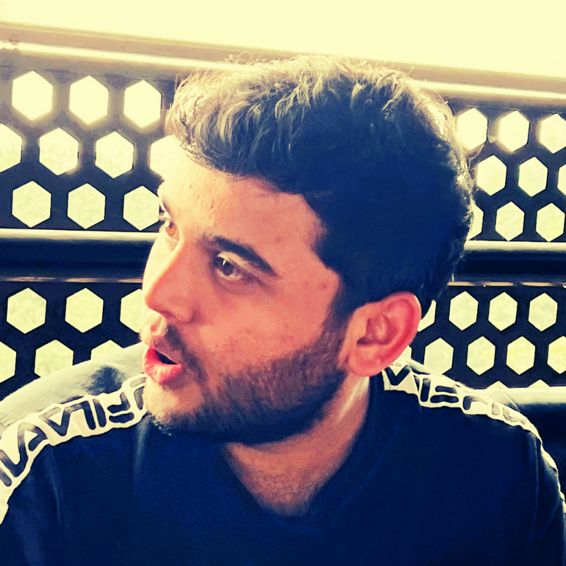

---
hide:
  - navigation
  - toc
---

<a href='https://bmc.link/smuktevi'>
{: align=right width="25%" style="border-radius: 50%;"}
</a>

### I'm Sai!

I'm currently a **Data Scientist** working on the **Microsoft Edge browser** in product growth, processing and analyzing large volumes of data coming in from hundreds of millions of users from all over the world. My projects focus on developing product telemetry, features and metrics all in an effort to increase or track growth. I work within the realms of user retention, acquisition, experimentation, churn and segmentation.

I deeply enjoy the process of helping products realize their true growth potential using data. I also have fun brainstorming new ideas for applications and building things from the ground up.

Outside of work I like to play volleyball, dance, hike and work on fun side projects.

#### HEADS UP! ~ I'm hoping to revamp this site with more content later on, but I'm currently working on a couple other things right now. I appreciate your patience!

**I'm happy to connect if you'd like to learn more about me and my work, so don't hesitate to get in touch! The best way to reach out to me is via [LinkedIn](https://www.linkedin.com/in/smuktevi/).** 

---

<!-- 

  

    <h2>The Firefly Jar Podcast by Vishu</h2>
    
<strong>I've been working on a new side project!</strong>

    
Since time immemorial, stories have been a powerful way to learn about great endeavors, scary encounters, heartwarming tales, and enlightening experiences.

    
Join me as I sit down with some wonderful people I’ve met over the years to listen to their stories and learn from their experiences. Together, we’ll listen, learn and grow.

    
  

  

      
In this collection of conversations, I ask a few simple questions to learn about things from my guests. Every perspective they give me is another firefly in the jar.

    
Support me with a small tip, it would definitely encourage me and help update my podcasting resources!

    
Check here weekly for my latest episode!
    <iframe src="https://podcasters.spotify.com/pod/show/vishu45/embed" style="border: 0; margin-top: 20px; border-radius: 15px; box-shadow: 0 0 10px rgba(0, 0, 0, 0.1); width: 100%; height: 102px;" frameborder="0" scrolling="no"></iframe>
    

  

 -->

This site was inspired by the works of [Vincent](https://koaning.io/), [Lj Miranda](https://ljvmiranda921.github.io/), [Chip Huyen](https://huyenchip.com/blog/), [Jay Allamar](https://jalammar.github.io/) and more.